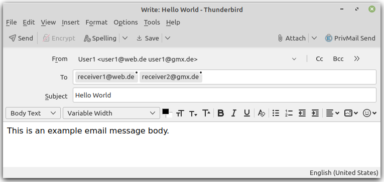
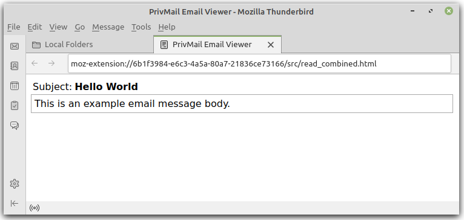

# PrivMail: Privacy-Preserving Email Transfer Plugin

This [Thunderbird](https://www.thunderbird.net) email client plugin enables secure transfer of emails between users using secret sharing.

## How to Load PrivMail into Thunderbird

To (temporary) load the PrivMail plugin/add-on into Thunderbird, this repository must be stored locally. Then navigate in Thunderbird:

1. Open the Hamburger-Menu and select `Add-Ons and Themes`. The `Add-Ons Manager` tab should open.
2. Select `Extenstions` on the left side.
3. Click on the gearwheel top right and select `Debug Add-ons`. The `Debugging` tab should open.
4. In the section `Temporary Extenstions`, click the button `Load Temporary Add-on...` and select the `manifest.json` file of this repository.

*Note: To apply changes, the add-on must be either reloaded in the `Debugging` tab, or removed and loaded again manually.*

## How to Use the Add-On

### Write Secure Emails

1. Select `Write` and write your Subject and message Body as usual.
2. Enter the receiver email addresses into the `To` field.
3. Enter the sender email addresses into the `From` field by selecting `Customize From Address...` and using the format `Sender <first-address second-address ...>` (e.g., `User1 <user1@web.de user1@gmx.de>`).
4. Click the `PrivMail Send` button on the top right to send the email (using secret sharing).

*Note: All selected `From`-addresses must be accounts in Thunderbird.*

### Read Secure Emails

Emails sent by this add-on can be identified by the subject following the scheme `<UID-8-bytes><shared subject>`, e.g., `qRjP4ohVMTcyLDksMjAyLDI1LDc=`.

Combining the secret shares of an email requires that all the email addresses/accounts that received shares are accounts in Thunderbird. Selecting one of those emails and clicking the `PrivMail Combine` button on the top right of the *MessageDisplay* will start a background search for the other shares within all Thunderbird accounts. If the shares are found, they will be combined to get the original text, which is displayed in an extra Thunderbird tab.

